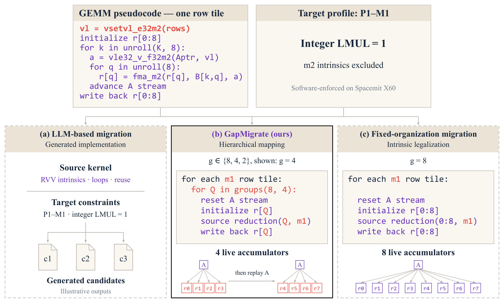
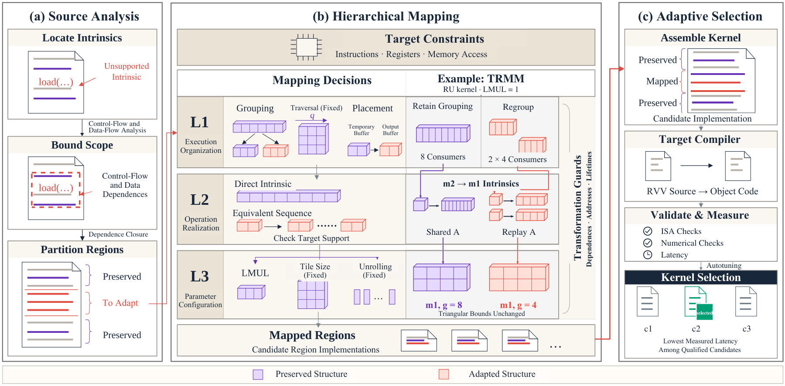
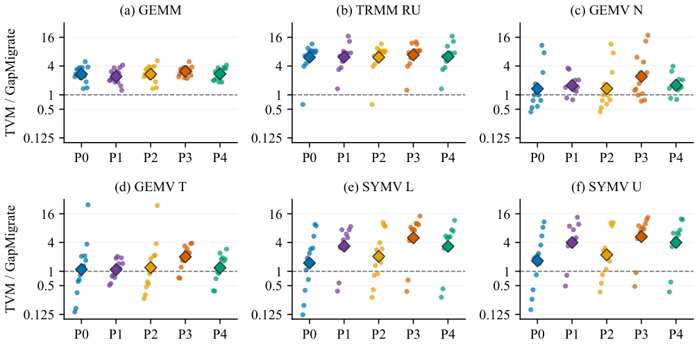
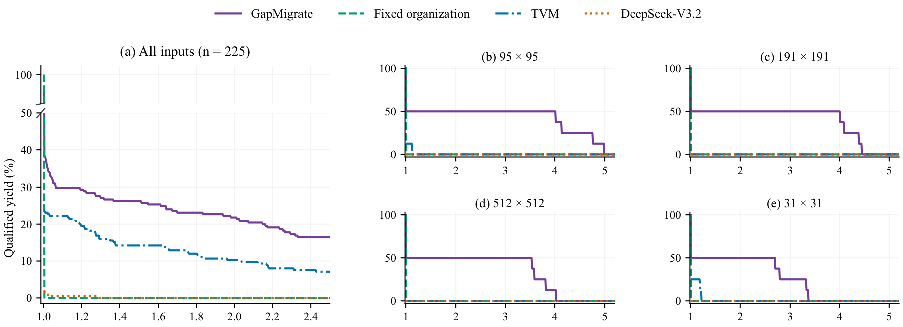

<p align="center">
  <picture>
    <source media="(prefers-color-scheme: dark)" srcset="assets/brand/logo-dark.svg">
    
  </picture>
</p>

<p align="center"><strong>Preserve useful structure. Adapt the incompatible region.</strong></p>
<p align="center">Source analysis · Hierarchical mapping · Measured selection</p>

# GapMigrate

GapMigrate is a research prototype for source-aware vector kernel migration. Unsupported intrinsics seed a conservative control-flow and dependence analysis. Checked rules retain compatible source structure and construct target candidates. Compilation, instruction admission, numerical validation and timing remain separate stages.

This repository packages the existing research components with a portable host-side CLI, examples and tests. It is **not a general translator for arbitrary C/C++**. Constructing a candidate does not establish its correctness or performance.

## Method illustrations

### Migration choices



Under the software-enforced m1 profile on Spacemit X60, the illustrated grouping choice reduces live accumulators from eight to four by replaying A. Purple marks preserved structure; red marks adaptation. This is a conceptual example, not a measured LLM output. [Vector PDF](assets/paper/migration_choices.pdf).

### Framework overview



Control-flow and data dependences bound adaptation. Hierarchical choices connect execution organization, operation realization and parameters before compilation, validation and measurement. [Vector PDF](assets/paper/framework_overview.pdf).

## Paper results on physical RVV hardware

These figures reproduce the V1.152 manuscript results on Spacemit X60, with RVV 1.0 and VLEN=256 under software-enforced profiles P0-P4. They are existing paper measurements, not new runs of the repository quick start.

### Latency compared with TVM



The ratio is **TVM latency / GapMigrate latency**; values above one favor GapMigrate. Panels cover six variants, five profiles and 15 shapes per profile. Dots show qualified pairs, diamonds geometric means, and dashed lines equal latency. Failed pairs are not plotted as speedups. [Vector PDF](assets/paper/tvm_latency_comparison.pdf).

### Qualified gain yield



The aggregate panel covers 225 triggered BLAS Level 2 entries. The x-axis is the speedup threshold over fixed organization; the y-axis is the percentage of entries that qualify and meet it. Unqualified returns remain in the denominator. Four shape panels show selected high-benefit cases, not representative averages. The aggregate panel omits 50-95% vertically. [Vector PDF](assets/paper/qualified_gain_yield.pdf).

## Quick start

Python 3.10 or newer is required for the core tools.

```sh
python -m pip install -e ".[dev]"
gapmigration analyze examples/vector_scale.c --profile P1 --output outputs/scope.json
gapmigration candidates examples/vector_scale.c --profile P1 --output outputs/candidates
python -m pytest
```

The synthetic example is an FP32 RVV scale loop using m2 intrinsics. P1 restricts LMUL to m1. The command emits an m1 candidate, a scope report and explicit rejection records for regrouping choices that do not match this source. No RISC-V hardware is needed to inspect the analysis. Compiling and validating the emitted C requires a suitable RVV compiler and execution target.

## Reproduce kernel correctness checks

The [standalone OpenBLAS benchmark package](experiments/openblas/README.md) includes six preprocessed FP32 RVV kernels, 109 historical migrated candidate snapshots, all 90 registered input configurations, and FP64-reference correctness/timing drivers. It supports native RISC-V GCC builds or cross-compilation followed by execution on physical RVV hardware.

```sh
bash experiments/openblas/run_all.sh
```

## Components

| Component | Purpose | Current boundary |
| --- | --- | --- |
| `src/gapmigration/scope.py` | Structured CFG, reaching definitions and conservative dependency closure | Unstructured control is rejected; closure is not globally minimal |
| `frontend.py`, `transforms.py` | Existing AST recovery and checked transformations | Bounded FP32/source schemas, not arbitrary C++ |
| `admission.py` | Disassembly-level capability checks | External calls need separate resolution and auditing |
| `clang_bridge.py` | Optional Clang JSON AST export | Separate inspection bridge, not the current CFG input |

The repository, branding and manuscript use the name **GapMigrate**.

## Capability profiles

| Profile | LMUL restriction | Vector reductions | Complex vector memory |
| --- | --- | --- | --- |
| P0 | None | Allowed | Allowed |
| P1 | m1 | Allowed | Allowed |
| P2 | None | Excluded | Allowed |
| P3 | None | Allowed | Excluded |
| P4 | m1 | Excluded | Excluded |

These are software-enforced experiment profiles. Support for analyzing a profile does not mean every unsupported operation has an implemented transformation in the CLI.

## RISC-V GCC and physical RVV execution

Emitted code uses `<riscv_vector.h>` and standard `__riscv_` intrinsics. Compile with RISC-V GCC and execute directly on a physical RVV Linux machine. The [RVV guide](docs/rvv.md) includes native and cross-compilation commands and a numerical smoke test.

This public package contains the RVV core and its host tests. It does not currently include a standalone, verified TVM tuning campaign for the physical RVV target. No tuning result is implied by the quick start.

## Clang and AST analysis

The existing prototype analyzer uses **pycparser** to build its AST and CFG. An optional external Clang AST inspection command is included in this release:

```sh
gapmigration clang-ast path/to/kernel.c --output outputs/clang-ast.json --flag=-Ipath/to/headers
```

Install Clang separately. Add the correct RISC-V target and include flags for RVV sources. Clang export and the pycparser analysis path are deliberately distinguished; no Clang-to-CFG integration is claimed here.

## Documentation

- [Architecture and limitations](docs/architecture.md)
- [RISC-V GCC and physical RVV execution](docs/rvv.md)
- [Brand assets](assets/brand/README.md)
- [Third-party notices and license status](THIRD_PARTY_NOTICES.md)
- [Contribution guidelines](CONTRIBUTING.md)

## License status

The authors have **not selected an open-source license** for this repository. No top-level license grant is implied. Dependencies retain their own licenses. Compiler binaries, upstream kernel distributions and private experimental records are not bundled.
