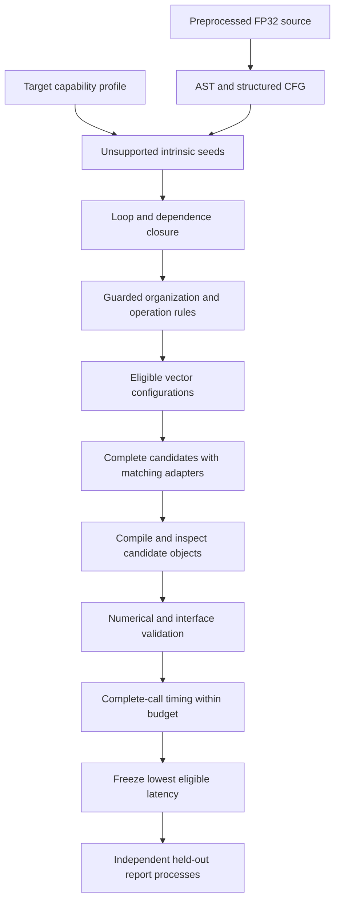

# Architecture and evidence boundaries

## Source analysis

Unsupported intrinsics seed the selected statement set. Structured loop membership, reaching definitions, vector representations and conservative memory relations expand it to a fixed point. Initialization and final uses may be included outside the immediate loop. The resulting closure is relative to the analyzer's model, not a globally minimal edit region. Lexical names and memory aliases are conservatively merged.

## Hierarchical mapping

L1 concerns execution organization, including consumer regrouping, vector materialization and reduction placement. L2 realizes unsupported operations with available mechanisms. L3 configures eligible vector groups. `mapping/level3.py` and `mapping/level2.py` recover these choices from registered source schemas. `mapping/materialize.py` checks that the original workspace is unused before adding boundary copies. `campaign.py` emits complete sources and analysis/containment records. The older `gapmigration candidates` command remains a small example, while `generate_candidates.py` handles the full six-variant pool.

## Validation and selection

Keep construction, object admission, numerical/interface checks and timing separate. Preserve timeout, failure and missing-result states. Do not replace a timeout with the timeout duration as a measured kernel latency. Any reported speedup needs the same workload and execution environment for both implementations.

`search.py` distinguishes observed-pool controls from independent fixed/full
searches. Construction-profile membership and object admission both constrain
selection. `runtime.py` bounds compiler processes and separates reference,
qualification and timing phases. `migration.py` records the protocol, freezes
selections and exports qualified source/executable pairs. See the
[execution guide](reproduce_migration.md) for commands and output schemas.

## Provenance of this package

Core CFG, AST transformation and instruction-admission modules were recovered from the existing research implementation. The command-line interface, synthetic example, host tests and optional Clang export bridge were added during repository preparation. No historical experiment was rerun merely by packaging these files. Historical paper tables are not regenerated by the quick start.

The first-stage migration release ports historical candidate rules into portable
modules. All 109 regenerated candidate token streams match the historical
artifacts. Native orchestration was refactored to remove fixed machine paths and
baseline integrations. Host tests cover its deadline and report behavior,
including mocked pipeline execution. New native RVV measurements have not yet
been collected for this portable runner.
